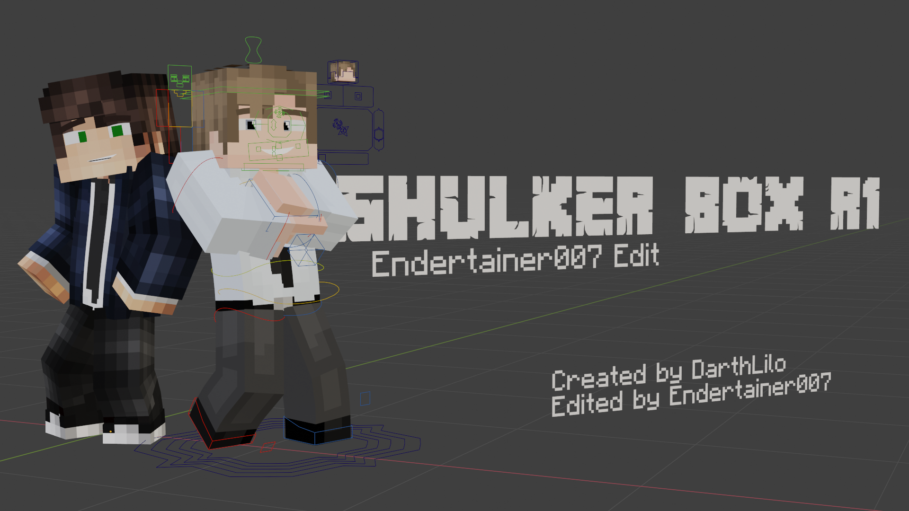

# Shulker Box R1 Endertainer007 Edit Rig

> 
> Whats is this Rig? 
> 
> This rig is a custom version of DarthLilo's Shulker Box R1.0.1 Rig. Other than that, it's pretty much the same to the original version. There is a lot of Minecraft Character rig out there that aims to give the user a good experience and quality. These rigs come with many different styles and features that give the user many options. And that's also the aims of this rig, to give the user a good quality rig with many features and options to gives the best experience and overall amazing result. Shulker Box R1 is an amazing advanced Rig created with many features and a good quality body model. This rig is a continuation of the now-discontinued LACM Rig (Lilo Advanced Character Model).
> 
>With that said, what's is this rig? And why it was created? 
> 
>This rig aims to improve the already good Shulker Box R1 with many new features and fixes to improve the overall experience. This rig also carries all the features from the original version with some tweaking. And this rig also developed for the latest version of Blender and keeps updates over time adjusting to the latest version of the software.

------ !! Disclaimer !! ------

This rig is not originally made by me. This Rig is based on the original Shulker Box R1.0.1 by DarthLilo. So all credits were to go to the original creator. I'm just customizing and improving this rig.

> What does this rig have? (v1.0.6a)

- New custom UI

- 90°/120°/180° Finger rotation switch

- Skin Preview

- Quick Emotions and Emotion Switch

- Labeled properties

- Thumbfill

- Custom Bone shapes & Color

- Teeth Switch

- 2nd Layer toggle

- Eyelash Switch

- New Female Eyebrows and Eyebrow Switch

- New Finger Control with Alex Arm support

- Alex UV

- Nose

- Fixed hair symmetry

- Monobrow

- Added Skin SSS material

- Minor detail fix

Shulker Box R1 (Original)
https://www.youtube.com/watch?v=P2w7eSFBshI

Made by DarthLilo
https://www.youtube.com/channel/UCz7K2OShbCbHp3pv3Q_pThQ

Edited by Endertainer007
- (Personal) https://www.youtube.com/channel/UCQqCAOYWkpV9FvDJF1fwHIQ
- (Main) https://www.youtube.com/channel/UCgCLI23G28Jts7ZT5WWWg8A

This rig is made for Blender 2.90 and higher

>Creators & Editors
- DarthLilo (Founder)
- Endertainer007 (Main Editor)
